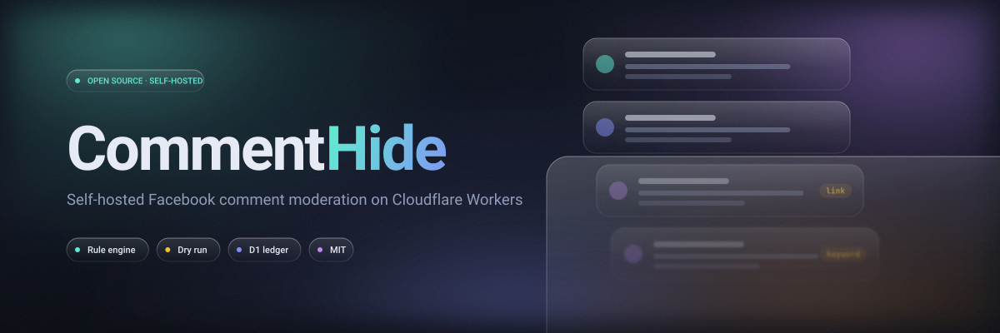
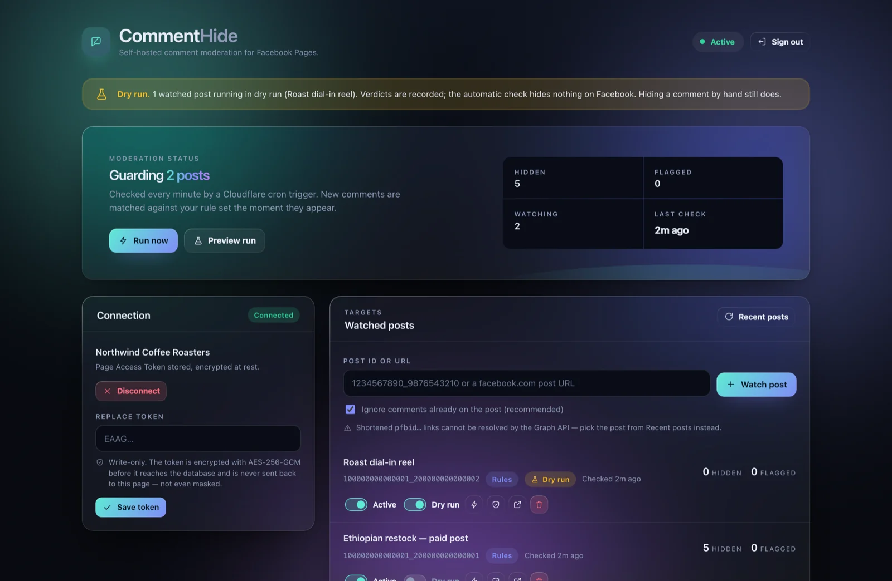
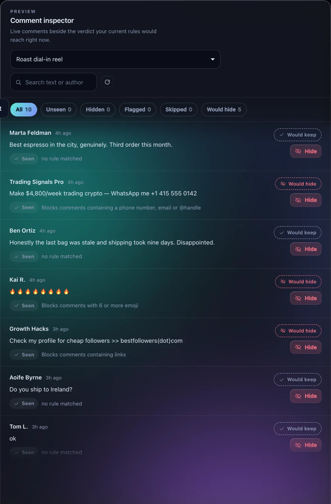
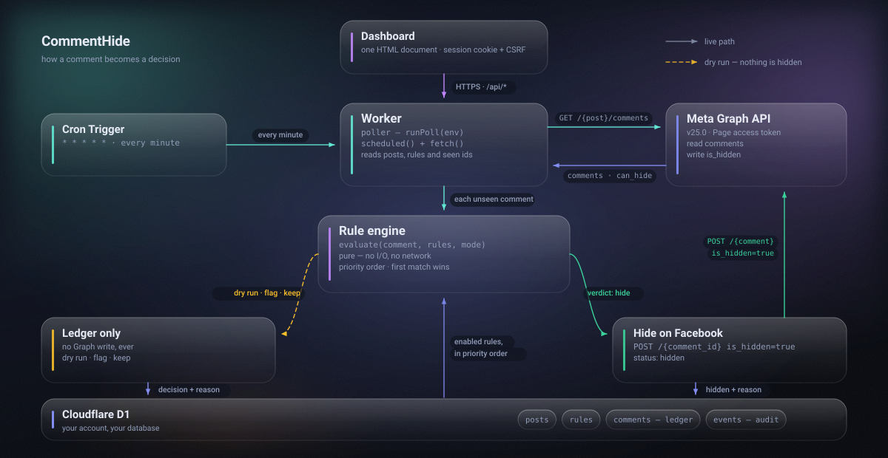
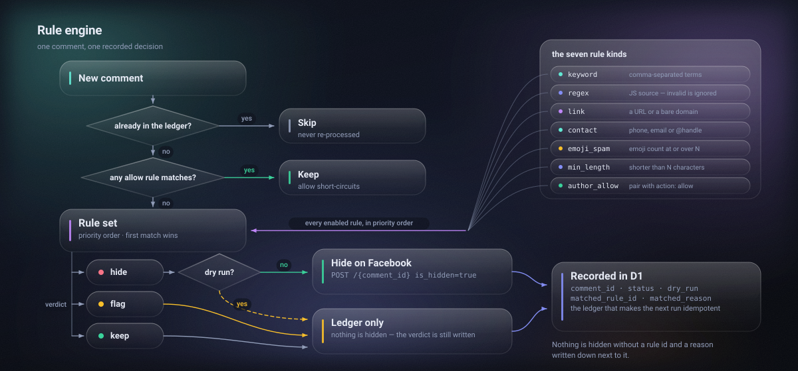
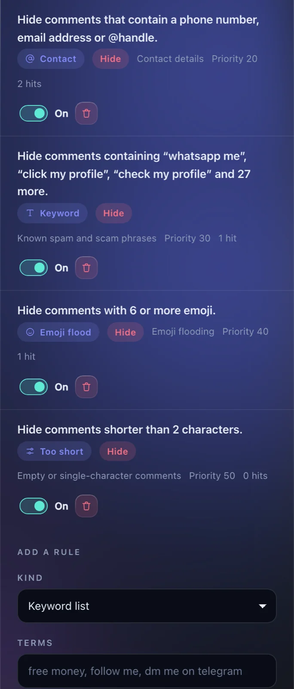

<p align="center">
  <picture>
    <source media="(prefers-color-scheme: dark)" srcset="assets/hero-dark.svg">
    <source media="(prefers-color-scheme: light)" srcset="assets/hero-light.svg">
    
  </picture>
</p>

<p align="center">
  <a href="https://github.com/Hiberius/commenthide-facebook-comment-moderation/actions/workflows/ci.yml"></a>
  <a href="LICENSE"></a>
  
  
  
  
</p>

# CommentHide — Self-Hosted Facebook Comment Moderation

**Automatically hide spam, scam and link-drop comments on your Facebook Page posts.**
CommentHide is an open-source Facebook comment moderation tool that runs as a single
Cloudflare Worker in your own account. A cron trigger checks your watched posts every
minute, evaluates each new comment against a rule engine you control, and hides only
what actually matches — through the official Meta Graph API.

No SaaS subscription. No third party ever sees your Page token or your comments.

<p align="center">
  <picture>
    <source media="(prefers-color-scheme: dark)" srcset="assets/screenshot-dashboard-dark.webp">
    <source media="(prefers-color-scheme: light)" srcset="assets/screenshot-dashboard-light.webp">
    
  </picture>
</p>

---

## Why this exists

If you run Facebook Ads, you know the pattern. A post starts performing, and within an
hour the comments fill up with crypto bait, "check my profile" follower farms, WhatsApp
numbers and competitors dropping links. Every one of them costs you clicks and social
proof, and Facebook gives you no way to filter them automatically.

The tools that solve this are subscriptions — €30 to €200 a month, per Page, with your
Page token living on someone else's server.

CommentHide does the same job on infrastructure you already own. Cloudflare's free tier
covers a minute-by-minute cron trigger and a D1 database comfortably, so running it
typically costs nothing.

| | Hosted moderation SaaS | CommentHide |
| --- | --- | --- |
| Cost | €30–200 / month, per Page | Free tier on Cloudflare |
| Where your Page token lives | Vendor's database | Your Cloudflare account, AES-256-GCM encrypted |
| Who can read your comments | Vendor | Nobody but you |
| Rules | Vendor's presets | Yours, seven rule kinds, priority ordered |
| Preview before it acts | Rarely | Dry run on every post |
| Auditability | A vendor dashboard | Every decision, with its reason, in your own database |
| Undo | Sometimes | One click, per comment or in bulk |
| Source | Closed | MIT |

---

## What makes it different: it decides, it doesn't just delete

Most "hide Facebook comments" scripts hide everything new. That is a blunt instrument —
it buries genuine questions and honest criticism along with the spam, and it is the
reason this category has a bad reputation.

CommentHide evaluates every comment against your rule set and records **why** it reached
each verdict. Here is the comment inspector on a real post, with the shipped starter
rules and nothing customised:

<p align="center">
  <picture>
    <source media="(prefers-color-scheme: dark)" srcset="assets/screenshot-inspector-dark.webp">
    <source media="(prefers-color-scheme: light)" srcset="assets/screenshot-inspector-light.webp">
    
  </picture>
</p>

The crypto bait, the follower farm and the wholesale-email drop are hidden, each labelled
with the rule that caught it. *"Honestly the last bag was stale and shipping took nine
days. Disappointed."* stays visible, because no rule matched it — and a moderation tool
has no business hiding that.

That column on the right is the part worth dwelling on. **Would keep** and **would hide**
show what your current rules would do to every comment *right now*, before you change
anything. Edit a rule, reload, and see the consequence before it reaches Facebook.

---

## Features

- **Rule engine, seven kinds** — keyword, regex, link, contact details, emoji flooding,
  minimum length, and an author allowlist that overrides everything else.
- **Dry run** — a watched post can evaluate and record every verdict while writing
  nothing to Facebook. Run it for a day, read the ledger, then switch it on for real.
- **Starts from now** — activating a post marks the comments already on it as seen, so
  switching CommentHide on can never touch existing conversation. It is the default.
- **Multiple posts** — watch as many as you like, each with its own mode and rules.
- **Replies** — optionally traverses reply threads, not just top-level comments.
- **Full audit trail** — every decision stored with its matched rule and reason.
- **One-click undo** — restore a single comment, or every comment the tool hid on a post.
- **Token encrypted at rest** — AES-256-GCM. It is never returned to the browser, never
  written to a log, and never placed in a URL.
- **Hardened by default** — CSP, CSRF double-submit tokens, rate-limited login,
  HMAC-signed session cookies.
- **Automatic retention** — old audit rows are pruned on a schedule you set.
- **Offline development** — a bundled mock Graph API lets you run the whole thing without
  a Facebook App, a Page, or a token.

---

## How it works

<p align="center">
  <picture>
    <source media="(prefers-color-scheme: dark)" srcset="assets/architecture-dark.svg">
    <source media="(prefers-color-scheme: light)" srcset="assets/architecture-light.svg">
    
  </picture>
</p>

A Cloudflare Cron Trigger wakes the Worker every minute. For each active post it resolves
the target once, fetches the latest comments from the Graph API, loads every already-seen
comment id in a single query, and evaluates only what it has never decided on before.

A comment is processed exactly once. The `comments` table is both the idempotency ledger
and the audit trail, which is what makes the tool safe to leave running: it cannot hide
the same comment twice, and it cannot forget what it did.

### The rule engine

<p align="center">
  <picture>
    <source media="(prefers-color-scheme: dark)" srcset="assets/rule-engine-dark.svg">
    <source media="(prefers-color-scheme: light)" srcset="assets/rule-engine-light.svg">
    
  </picture>
</p>

Allow rules are evaluated first, always, so an allowlist can never be outranked by a
higher-priority hide rule. Then the remaining rules run in priority order and the first
match wins. The verdict, the rule that produced it and a human-readable reason are all
written to the ledger.

| Rule kind | Pattern | Hides when |
| --- | --- | --- |
| `keyword` | comma-separated terms | a term appears as a whole word — case- and accent-insensitive, so `perche` matches `PERCHÈ` |
| `regex` | JS regex source | the expression matches; an invalid one is skipped, never fatal |
| `link` | — | the text contains a URL, a bare domain, or an obfuscation like `example(dot)com` |
| `contact` | — | it contains a phone number, an email address or an `@handle` |
| `emoji_spam` | threshold — starter rule uses 6, falls back to 5 | the comment carries that many emoji or more |
| `min_length` | threshold — starter rule uses 2, falls back to 3 | the trimmed comment is shorter than that |
| `author_allow` | names or ids | the author matches — pair with the `allow` action |

Every rule carries an action (`hide`, `flag` or `allow`) and a priority. `flag` records a
verdict and never writes to Facebook, which makes it a good way to trial a new rule on a
live post without consequences.

<p align="center">
  <picture>
    <source media="(prefers-color-scheme: dark)" srcset="assets/screenshot-rules-dark.webp">
    <source media="(prefers-color-scheme: light)" srcset="assets/screenshot-rules-light.webp">
    
  </picture>
</p>

---

## Quickstart

You need a Cloudflare account (the free plan is enough), Node 22+, and a Facebook Page
you administer.

```bash
git clone https://github.com/Hiberius/commenthide-facebook-comment-moderation.git
cd commenthide-facebook-comment-moderation
npm install
npm run setup
```

`npm run setup` checks your toolchain, creates `wrangler.toml` from the example, and
generates the two random keys you need — printing the exact commands to run. Then:

```bash
npm run db:create            # prints your D1 database_id -> paste it into wrangler.toml
npm run db:apply:remote      # create the schema
npx wrangler secret put ADMIN_PASSWORD
npx wrangler secret put ENCRYPTION_KEY
npx wrangler secret put SESSION_SECRET
npm run deploy
```

Open the Worker URL, sign in with `ADMIN_PASSWORD`, paste a Page Access Token, add a
post, and leave it in dry run for a while before switching it on.

### Getting a Page Access Token

CommentHide needs a **Page** Access Token — not a personal user token — with these
permissions:

- `pages_read_engagement` — read the post and its comments
- `pages_manage_engagement` — set `is_hidden` on a comment

Create an app at [developers.facebook.com](https://developers.facebook.com/), add the
**Facebook Login for Business** or **Pages API** product, then use the
[Graph API Explorer](https://developers.facebook.com/tools/explorer/) to issue a token
for the Page you administer. Exchange it for a long-lived token so it does not expire in
an hour — see [Meta's Page access token guide](https://developers.facebook.com/docs/pages/access-tokens).

If you paste a user token that manages the Page, CommentHide resolves the correct Page
token for you automatically through `/me/accounts`.

### Configuration

Secrets — set with `wrangler secret put`, never committed:

| Secret | What it is |
| --- | --- |
| `ADMIN_PASSWORD` | Dashboard login. Use a long random passphrase. |
| `ENCRYPTION_KEY` | base64 of 32 random bytes. `openssl rand -base64 32` |
| `SESSION_SECRET` | Session cookie signing key. `openssl rand -base64 48` |

Public variables in `wrangler.toml`:

| Variable | Default | What it does |
| --- | --- | --- |
| `GRAPH_API_VERSION` | `v25.0` | Graph API version segment |
| `RETENTION_DAYS` | `30` | Prune audit rows older than this. `0` disables it. Hidden comments are never pruned — they are the undo trail. |
| `GRAPH_API_BASE` | unset | Development only. Points the client at a mock instead of Meta. |

---

## Security model

The threat this project takes seriously is your Page Access Token, because it is the one
secret that could be used against you.

- **Encrypted at rest.** AES-256-GCM with a random 12-byte IV per encryption, using a key
  that lives only as a Cloudflare secret.
- **Write-only from the browser.** The dashboard can set the token and can never read it
  back — not even masked. `/api/status` returns a boolean, not a value.
- **Never in a URL.** Graph reads carry it as a `Bearer` header and writes carry it in
  the form body, so it cannot land in a proxy log or an error report.
- **Never in a log.** Every message that leaves the Graph client passes through a
  redaction pass first.
- **Sessions** are HMAC-SHA256 signed cookies with `__Host-` prefix, `HttpOnly`,
  `Secure`, `SameSite=Strict` and a seven-day lifetime.
- **Login is rate limited** — eight failures inside fifteen minutes locks that client for
  fifteen minutes, and a locked client is refused before the password is ever compared.
- **CSRF** is a double-submit token required on every state-changing request.
- **CSP** is `default-src 'none'` with no external origin allowed. The dashboard loads no
  web font, no CDN script and no analytics; the entire UI is one self-contained document.
- **SQL** is fully parameterised; the two dynamic `UPDATE` statements build column names
  from literal allow-lists, never from input.
- **Comment text is never treated as markup.** The dashboard builds DOM nodes with
  `textContent`, so a comment containing HTML is displayed, not executed.

Found something? Please open a private security advisory — see [SECURITY.md](SECURITY.md).

---

## Responsible use

This tool hides comments on posts you own, through an API Meta provides for exactly that
purpose. Hidden comments are not deleted: they stay visible to their author and to that
author's friends, which is how Facebook's own hide function behaves.

It is built to remove spam, scams, harassment and off-topic noise. It is not built to
bury criticism, and the defaults reflect that — the starter rules match link drops,
contact-detail spam, emoji floods and known scam phrasing, and nothing that resembles an
unhappy customer. The dry run, the stated reason on every verdict and the one-click undo
all exist so you can check that for yourself rather than take it on trust.

Using it to silence legitimate feedback is a choice you would be making, not one this
project makes for you. Please also read Meta's
[Platform Terms](https://developers.facebook.com/terms/) — you are responsible for your
own compliance.

---

## Local development

You do not need a Facebook App to work on CommentHide. A mock Graph API ships with it:

```bash
npm install
cp .dev.vars.example .dev.vars     # then fill in the three values
npm run db:apply:local

npm run mock:graph                 # terminal 1 — fake Graph API on :8788
npm run dev:mock                   # terminal 2 — the Worker, pointed at the mock
```

Sign in, paste any non-empty string as the token, and add
`100000000000001_200000000000001` as a post. The mock serves a deliberately mixed comment
thread — spam, borderline cases and honest criticism — which is what the screenshots in
this README were captured from.

Cron triggers do not fire under `wrangler dev`, so use **Run now** in the dashboard to
exercise the poll loop.

```bash
npm run typecheck
npm test
npm run test:coverage
```

299 tests currently pass. The rule engine is pure and covered to 100% of statements; the
Graph client is tested against an injected `fetch` and never touches the network.

<details>
<summary><strong>HTTP API reference</strong></summary>

Every route below requires a session cookie, and every non-`GET` route requires the
`x-csrf-token` header. `POST /api/session` and `GET /health` are the two exceptions.

| Method | Path | Purpose |
| --- | --- | --- |
| `POST` | `/api/session` | Sign in; returns the CSRF token |
| `DELETE` | `/api/session` | Sign out |
| `GET` | `/api/status` | Dashboard state, totals and watched posts |
| `PUT` | `/api/page/token` | Verify and store the Page Access Token |
| `DELETE` | `/api/page/token` | Forget the stored token |
| `GET` | `/api/page/posts` | Recent posts on the connected Page |
| `GET` `POST` | `/api/posts` | List, or start watching a post |
| `PATCH` `DELETE` | `/api/posts/:postId` | Update or stop watching |
| `GET` | `/api/posts/:postId/comments` | Live comments with current and would-be verdicts |
| `POST` | `/api/posts/:postId/test` | Verify token and post reachability |
| `POST` | `/api/posts/:postId/restore` | Unhide everything the tool hid on that post |
| `GET` `POST` | `/api/rules` | List or create a rule |
| `PATCH` `DELETE` | `/api/rules/:id` | Update or delete a rule |
| `POST` | `/api/rules/seed` | Install the starter rule set |
| `POST` | `/api/run` | Run the poll now, optionally as a dry run |
| `POST` | `/api/comments/:commentId/hide` | Hide one comment manually |
| `POST` | `/api/comments/:commentId/show` | Unhide one comment |
| `GET` | `/api/events` | Recent audit events |
| `GET` | `/health` | Public health check |

</details>

<details>
<summary><strong>Project layout</strong></summary>

```
src/
├── index.ts            Hono app, middleware, cron handler
├── types.ts            every shared type — the single source of truth
├── lib/
│   ├── crypto.ts       AES-256-GCM, redaction, constant-time compare
│   ├── auth.ts         sessions, CSRF, login throttling
│   ├── security.ts     CSP and security headers
│   ├── graph.ts        Meta Graph client — memoised target resolution
│   ├── graph-http.ts   transport: auth placement, retry, backoff
│   ├── graph-parse.ts  pure parsing and error copy
│   ├── rules.ts        the rule engine — pure, no I/O
│   ├── poller.ts       the poll loop
│   ├── poll-comment.ts per-comment decision and action
│   ├── retention.ts    scheduled pruning
│   └── storage/        one D1 module per table
├── routes/             one Hono sub-app per resource
└── ui/                 the dashboard — markup, styles, client script
```

Every file is under 400 lines, on purpose.

</details>

---

## Roadmap

- Meta Webhooks for sub-second hiding, with cron as the fallback
- Rule templates you can import and share
- CSV export of the audit ledger
- Optional Slack or email digest of what was hidden
- Per-post rule overrides in the dashboard

Issues and pull requests are welcome — see [CONTRIBUTING.md](CONTRIBUTING.md).

## FAQ

**Does this delete comments?** No. It only sets `is_hidden`, the same flag as Facebook's
own Hide button. Nothing is ever deleted, and every hide is reversible from the dashboard.

**How fast does it hide a comment?** Within a minute, on the next cron tick. Webhooks are
on the roadmap for near-instant hiding.

**Does it work on Instagram comments?** Not yet. The Instagram Graph API exposes a
comparable endpoint, and the client is structured to allow it.

**Will this get my Page banned?** It uses documented Graph API endpoints with the
permissions Meta grants for exactly this purpose. Keep within the rate limits — the
default of one poll a minute is well inside them.

**Can I watch more than one post?** Yes, as many as you want, each with its own mode,
dry-run setting and reply behaviour.

**What does it cost to run?** On Cloudflare's free plan, typically nothing. One poll a
minute is roughly 43,000 requests a month against a 100,000/day free allowance, and the
D1 free tier covers the storage many times over.

**Does anything leave my infrastructure?** Only the calls to Meta's Graph API. There is
no telemetry, no analytics and no third-party request of any kind.

**Can I try it without a Facebook App?** Yes — `npm run mock:graph` runs a complete
offline Graph API.

---

## Hire me

I build tools like this one — performance marketing systems, internal automation, and
products on the Cloudflare edge stack. If you need something similar built properly,
I take on freelance and contract work.

**[Christian Calabro — github.com/Hiberius](https://github.com/Hiberius)**

Performance marketing · media buying · TypeScript · Cloudflare Workers · Next.js · Python

---

## License

[MIT](LICENSE) © 2026 Christian Calabro

CommentHide is an independent open-source project. It is not affiliated with, endorsed by,
or sponsored by Meta Platforms, Inc. Facebook is a trademark of Meta Platforms, Inc.
